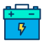
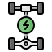
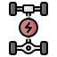

## 混动类型：

* `PHEV`: 插电式混合动力汽车
    1. p1+p3: `纯电`/`串联`/`并联`/`直驱`
    2. p2/2.5: `纯电`/`并联`/`直驱`

* `REEV`: 增程式电动汽车, `纯电`/`串联`

## 混动模式：

* `纯电`: `电池`放电向`驱动电机`提供电力驱动车辆，电量不足时进入`串联`模式。。

    

* `串联`: `发动机`带动`发电机`发电向`驱动电机`提供电力驱动车辆，动力充足时进入`充电`模式。

     

* `并联`: `电池`放电向`驱动电机`提供电力，和`发动机`共同驱动车辆。

    

* `直驱`: `发动机`直接驱动车辆，动力不足时进入`并联`模式，动力充足时进入`充电`模式。

    

* `充电`: `发动机`带动`发电机`发电为`电池`充电。

     

* `动能回收`: 在制动或滑行时，`驱动电机`反向为`电池`充电。

     

## 名称解释：

* `EV`: Electric Vehicle, 电动汽车
* `BEV`: Battery Electric Vehicle, 纯电动汽车
* `HEV`: Hybrid Electric Vehicle, 混合动力汽车
* `PHEV`: Plug-in Hybrid Electric Vehicle, 插电式混合动力汽车
* `REEV`: Range Extender Electric Vehicle, 增程式电动汽车
* `EREV`: Extended-Range Electric Vehicle, 增程式电动汽车
* `EM`: Electric Motor, 电动机
* `GM`: Generator Motor, 发电机
* `TM`: Traction Motor, 驱动电机

